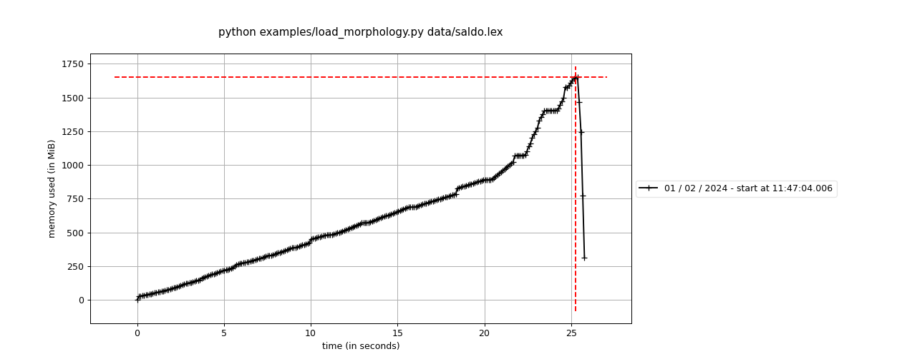
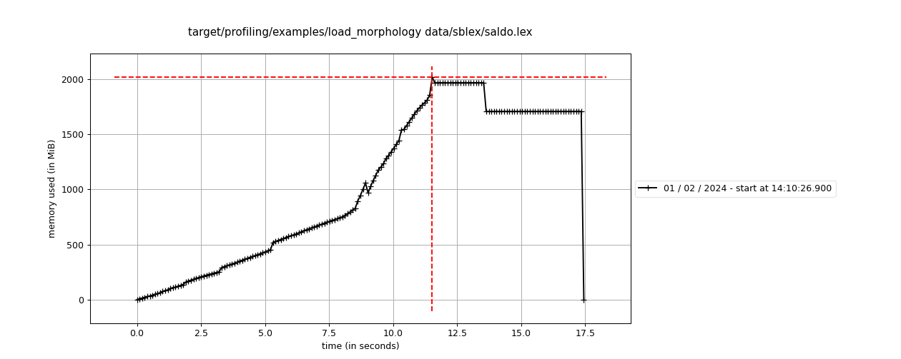
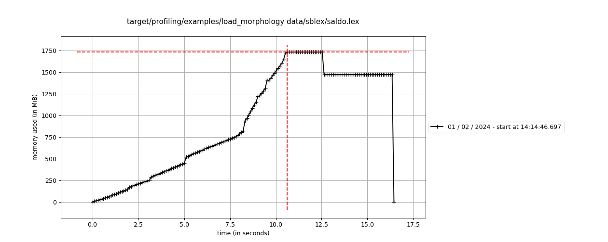
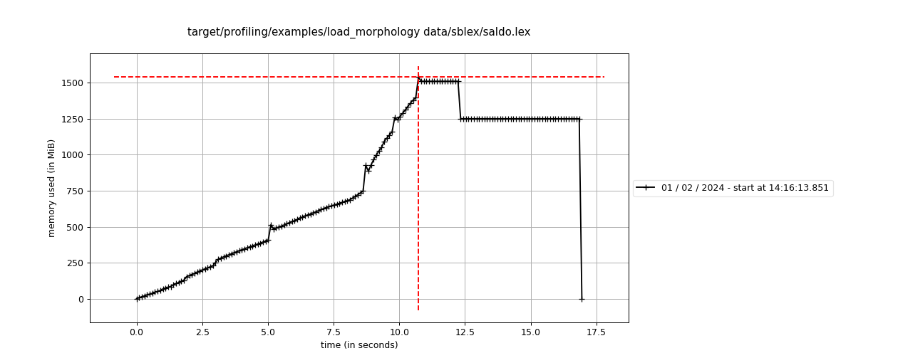
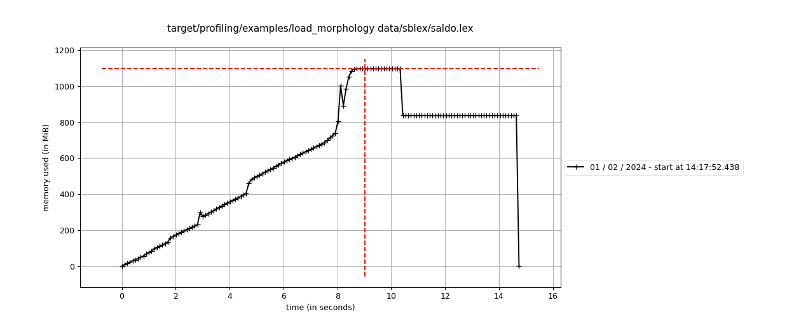

# Port fm-server to Rust

## Python code

```python
"""FM morphology."""

import abc
import logging
import sys

import json_arrays
from json_arrays.utility import JsonFormat
from opentelemetry import trace
from sblex.trie import Trie

logger = logging.getLogger(__name__)


class Morphology(abc.ABC):
    @abc.abstractmethod
    async def lookup(self, word: str, n: int = 0) -> bytes: ...

    @abc.abstractmethod
    async def lookup_from_bytes(self, s: bytes) -> bytes: ...


class MemMorphology(Morphology):
    def __init__(self, trie: Trie) -> None:
        self._trie = trie

    @classmethod
    def from_path(cls, fname: str) -> "Morphology":
        with trace.get_tracer(__name__).start_as_current_span(
            sys._getframe().f_code.co_name
        ) as _process_api_span:
            logger.info("building morphology structure... (takes about 1 minute)")
            return cls(
                trie=Trie.from_iter(
                    json_arrays.load_from_file(fname, json_format=JsonFormat.JSON_LINES)
                )
            )

    async def lookup(self, word: str, n: int = 0) -> bytes:
        return r if (r := self._trie.lookup(word, n)) else b'{"id":"0","a":[],"c":""}'

    async def lookup_from_bytes(self, s: bytes) -> bytes:
        try:
            res = s.decode("UTF-8").split(" ", 1)
            n = int(res[0])
            word = res[1]
            if r := self._trie.lookup(word, n):
                return r
        except:  # noqa: E722, S110
            pass
        return b'{"id":"0","a":[],"c":""}'
```

```python
import logging
import time
from typing import Any, Iterable

from json_arrays import jsonlib

logger = logging.getLogger(__name__)


class Trie:
    def __init__(self, trie: dict[int, tuple[dict[str, int], bytes]]) -> None:
        self._trie: dict[int, tuple[dict[str, int], bytes]] = trie

    @classmethod
    def from_iter(cls, dicts: Iterable[dict[str, Any]]) -> "Trie":
        logger.info("building morphology structure... (takes about 1 minute)")
        build_started = time.perf_counter()
        trie_builder = TrieBuilder()
        for j in dicts:
            w = j["word"]
            a = {
                "gf": j["head"],
                "id": j["id"],
                "pos": j["pos"],
                "is": j["inhs"],
                "msd": j["param"],
                "p": j["p"],
            }
            trie_builder.insert(w, jsonlib.dumps(a))

        logger.info("number of word forms read: %d", trie_builder.number_of_insertions())
        logger.info("number of states: %d", trie_builder.state)
        logger.info("initiating precomputation...")
        trie = trie_builder.build()
        elapsed = time.perf_counter() - build_started
        logger.info("building morphology took %d s", elapsed)
        return trie

    def lookup(self, word: str, start_state=0) -> bytes:
        st = start_state  # traversal state
        for c in word:
            try:
                st = self._trie[st][0][c]
            except:  # noqa: E722
                return b""
        return self._trie[st][1]


def wrap(s: bytes) -> bytes:
    return b"\n" + s + b"\n" if s else s


class TrieBuilder:
    def __init__(self) -> None:
        self.trie: dict[int, tuple[dict[str, int], list[bytes]]] = {0: ({}, [])}
        self.state = 0  # state counter
        self.count = 0  # number of insertions

    def insert(self, word: str, decoration: bytes):
        self.count += 1
        st = 0  # traversal state
        for i in range(len(word)):
            try:
                st = self.trie[st][0][word[i]]
            except:  # noqa: E722
                self.complete(st, word[i:], decoration)
                return
        self.trie[st][1].append(decoration)

    # create a new branch
    def complete(self, st: int, word: str, decoration: bytes):
        for c in word:
            self.state += 1
            self.trie[st][0][c] = self.state
            self.trie[self.state] = ({}, [])
            st = self.state
        self.trie[st][1].append(decoration)

    def number_of_insertions(self):
        return self.count

    def precompute(self) -> dict[int, tuple[dict[str, int], bytes]]:
        trie_precomputed = {}
        max_num_transitions = 0
        for i in range(self.state + 1):
            tr = self.trie[i][0]
            max_num_transitions = max(max_num_transitions, len(tr))
            dec = self.trie[i][1]
            # ys  = [x.encode('UTF-8') for x in dec]
            ys = b",".join(dec)
            cont = ("".join(self.continuation(i))).encode("UTF-8")
            trie_precomputed[i] = (
                tr,
                b'{"a":[%s],"c":"%s"}' % (ys, cont),
            )
        logger.info("max number of transitions in trie: %d", max_num_transitions)
        return trie_precomputed

    def continuation(self, state: int):
        return list(self.trie[state][0].keys())

    def build(self) -> Trie:
        trie = self.precompute()
        logger.info("precomputing: done")
        return Trie(trie=trie)

```

Memory usage:


## Rust code

```rust
use std::fmt;
use std::{fs, io};
use std::{io::BufRead, path::Path};

use serde_json::{json, Value};
use tracing::instrument;

use crate::trie::Trie;

#[derive(Debug)]
pub enum Error {
    Io(io::Error),
    Json(serde_json::Error),
}

impl fmt::Display for Error {
    fn fmt(&self, f: &mut fmt::Formatter<'_>) -> fmt::Result {
        match self {
            Self::Io(err) => f.write_fmt(format_args!("IO error: {}", err)),
            Self::Json(err) => f.write_fmt(format_args!("Json error: {}", err)),
        }
    }
}

impl std::error::Error for Error {
    fn source(&self) -> Option<&(dyn std::error::Error + 'static)> {
        match self {
            Self::Io(err) => Some(err),
            Self::Json(err) => Some(err),
        }
    }
}

impl From<io::Error> for Error {
    fn from(value: io::Error) -> Self {
        Self::Io(value)
    }
}
impl From<serde_json::Error> for Error {
    fn from(value: serde_json::Error) -> Self {
        Self::Json(value)
    }
}

#[derive(Debug, Clone, serde::Serialize, serde::Deserialize)]
pub struct Morphology {
    trie: Trie,
}

impl Morphology {
    pub fn new(trie: Trie) -> Self {
        Self { trie }
    }

    #[instrument(skip(path))]
    pub fn from_path<P: AsRef<Path>>(path: P) -> Result<Self, Error> {
        let file = fs::File::open(path)?;
        let reader = io::BufReader::new(file);
        let mut trie_builder = Trie::builder();
        for line in reader.lines() {
            let j: Value = serde_json::from_str(&line?)?;
            let w = &j["word"];
            let a = json!({
                "gf": j["head"],
                "id": j["id"],
                "pos": j["pos"],
                "is": j["inhs"],
                "msd": j["param"],
                "p": j["p"]
            });
         
            trie_builder.insert(w.as_str().expect("fm.morphology word"), a.to_string());
        }
        Ok(Self::new(trie_builder.build()))
    }

    pub fn lookup(&self, fragment: &str) -> Option<&str> {
        self.trie.lookup_with_state(fragment, 0)
    }
    pub fn lookup_with_state(&self, fragment: &str, state: usize) -> Option<&str> {
        self.trie.lookup_with_state(fragment, state)
    }
}
```

```rust
use hashbrown::HashMap;

use unicode_segmentation::{Graphemes, UnicodeSegmentation};

#[derive(Debug, Clone, serde::Serialize, serde::Deserialize)]
pub struct Trie {
    trie: HashMap<usize, (HashMap<String, usize>, String)>,
}

impl Trie {
    fn new(mut builder: TrieBuilder) -> Trie {
        let mut trie = HashMap::with_capacity(builder.state);
        for i in 0..=builder.state {
            let (tr, dec) = builder.trie.remove(&i).expect("state exist");
            let mut cont_chars = tr.keys().map(|s| &**s).collect::<Vec<_>>();
            cont_chars.sort();
            let cont = cont_chars.join("");
            let ys = dec.join(",");
            let value = format!(r#"{{"a":[{ys}],"c":"{cont}"}}"#);
            trie.entry(i).insert((tr, value));
        }
        Trie { trie }
    }

    pub fn builder() -> TrieBuilder {
        TrieBuilder::default()
    }

    pub fn lookup(&self, word: &str) -> Option<&str> {
        self.lookup_with_state(word, 0)
    }
    pub fn lookup_with_state(&self, word: &str, start_state: State) -> Option<&str> {
        let mut st = start_state;
        for c in word.graphemes(true) {
            st = match self.trie.get(&st) {
                Some(tuple) => match tuple.0.get(c) {
                    Some(state) => *state,
                    None => return None,
                },
                None => return None,
            };
        }
        self.trie.get(&st).map(|x| x.1.as_str())
    }
}

#[derive(Debug)]
pub struct TrieBuilder {
    count: usize,
    state: State,
    trie: HashMap<State, (StringStateMap, Vec<String>)>,
}

impl Default for TrieBuilder {
    fn default() -> Self {
        let mut trie = HashMap::new();
        trie.insert(0, (StringStateMap::default(), Vec::default()));
        TrieBuilder {
            count: 0,
            state: 0,
            trie,
        }
    }
}
impl TrieBuilder {
    pub fn build(self) -> Trie {
        Trie::new(self)
    }

    pub fn insert<S: Into<String>>(&mut self, word: &str, decoration: S) {
        self.count += 1;
        let mut st = 0;
        let mut iter = word.graphemes(true);
        loop {
            let curr_iter = iter.clone();
            let c = match iter.next() {
                Some(c) => c,
                None => break,
            };
            st = match self.trie.get(&st) {
                Some(tuple) => match tuple.0.get(c) {
                    Some(state) => *state,
                    None => {
                        return self.complete(st, curr_iter, decoration.into());
                    }
                },

                None => todo!(),
            };
        }
        self.trie
            .entry(st)
            .and_modify(|e| e.1.push(decoration.into()));
    }

    // create a new branch
    fn complete(&mut self, mut st: State, word: Graphemes, decoration: String) {
        for c in word {
            self.state += 1;
            self.trie
                .get_mut(&st)
                .expect("st exists")
                .0
                .insert(c.into(), self.state);
            self.trie
                .entry(self.state)
                .insert((StringStateMap::default(), Vec::default()));
            st = self.state;
        }
        self.trie.entry(st).and_modify(|e| e.1.push(decoration));
    }
    pub fn number_of_insertions(&self) -> usize {
        self.count
    }
}
```

Memory usage:


## Improvements

### Replace `String` with `ArcStr` for values

```diff
+use arcstr::ArcStr;
use unicode_segmentation::{Graphemes, UnicodeSegmentation};

#[derive(Debug, Clone, serde::Serialize, serde::Deserialize)]
pub struct Trie {
-    trie: HashMap<usize, (HashMap<String, usize>, String)>,
+    trie: HashMap<State, (HashMap<String, usize>, ArcStr)>,
}

    let ys = dec.join(",");
-   let value = format!(r#"{{"a":[{ys}],"c":"{cont}"}}"#);
+   let value = ArcStr::from(format!(r#"{{"a":[{ys}],"c":"{cont}"}}"#));
    trie.entry(i).insert((tr, value));
```

Memory usage:


### Replace `String` with `ArcStr` for keys

```diff
#[derive(Debug, Clone, serde::Serialize, serde::Deserialize)]
pub struct Trie {
-    trie: HashMap<usize, (HashMap<String, usize>, ArcStr)>,
+    trie: HashMap<usize, (HashMap<ArcStr, usize>, ArcStr)>,
}

#[derive(Debug)]
pub struct TrieBuilder {
    count: usize,
    state: usize,
-   trie: HashMap<usize, (HashMap<String, usize>, ArcStr)>,
+    trie: HashMap<usize, (HashMap<ArcStr, usize>, Vec<String>)>,
}

fn complete(&mut self, mut st: usize, word: Graphemes, decoration: String) {
        // println!("complete: st = {}, word = {}", st, word.as_str());
        for c in word {
            self.state += 1;
            self.trie
                .get_mut(&st)
                .expect("st exists")
                .0
-               .entry(c.to_string())
-               .insert(self.state);
+               .insert(c.into(), self.state);
```

Memory usage:


## Decompose builder

```diff
impl Trie {
+   fn new(mut builder: TrieBuilder) -> Trie {
+       let mut trie = HashMap::with_capacity(builder.state);
+       for i in 0..=builder.state {
+           let (tr, dec) = builder.trie.remove(&i).expect("state exist");
+           let mut cont_chars = tr.keys().map(|s| &**s).collect::<Vec<_>>();
+           cont_chars.sort();
+           let cont = cont_chars.join("");
+           let ys = dec.join(",");
+           let value = ArcStr::from(format!(r#"{{"a":[{ys}],"c":"{cont}"}}"#));
+           trie.entry(i).insert((tr, value));
+       }
+       Trie { trie }
+   }

    pub fn builder() -> TrieBuilder {
        TrieBuilder::default()
    }

impl TrieBuilder {
    pub fn build(self) -> Trie {
-       let mut trie = HashMap::new();
-       for i in 0..=self.state {
-           let tr_dec = self.trie.get(&i).expect("state exist");
-           let tr = tr_dec.0.clone();
-           let mut cont_chars = tr.keys().map(|s| &**s).collect::<Vec<_>>();
-           cont_chars.sort();
-           let cont = cont_chars.join("");
-           let ys = tr_dec.1.iter().map(|s| &**s).collect::<Vec<_>>().join(",");
-           let value = ArcStr::from(format!(r#"{{"a":[{ys}],"c":"{cont}"}}"#));
-           trie.entry(i).insert((tr, value));
-       }
-       Trie { trie }
+       Trie::new(self)
    }
    pub fn build(self) -> Trie {
        Trie::new(self)
    }
```

Memory usage:


## Python server

```python
from fastapi import APIRouter, Depends, Response
from sblex.fm.morphology import Morphology
from sblex.fm_server import deps

router = APIRouter()


@router.get("/morph/{fragment}/{n}")
async def get_morph(
    fragment: str,
    n: int = 0,
    morphology: Morphology = Depends(deps.get_morphology),  # noqa: B008
):
    json_data = await morphology.lookup(fragment, n)
    return Response(json_data, media_type="application/json")
```

## Rust server

```rust
use axum::{
    extract::{Path, State},
    http::{header, HeaderMap, StatusCode},
    response::IntoResponse,
    routing, Router,
};
use axum_tracing_opentelemetry::middleware::{OtelAxumLayer, OtelInResponseLayer};
use tracing::instrument;
use tracing_opentelemetry_instrumentation_sdk::find_current_trace_id;

use crate::state::AppState;

pub fn morph_routes(state: AppState) -> Router {
    Router::new()
        .route("/:fragment/:n", routing::get(get_morph))
        // include trace context as header into the response
        .layer(OtelInResponseLayer)
        //start OpenTelemetry trace on incoming request
        .layer(OtelAxumLayer::default())
        .with_state(state)
}

#[derive(serde::Deserialize)]
struct Params {
    fragment: String,
    n: Option<usize>,
}

#[instrument(name = "get-morph", skip(state))]
async fn get_morph(
    State(state): State<AppState>,
    Path(Params { fragment, n }): Path<Params>,
) -> impl IntoResponse {
    tracing::debug!(?fragment, "get_morph called");
    let trace_id = find_current_trace_id();
    tracing::debug!(?trace_id, "again");
    let json_data = state
        .morphology
        .read()
        .await
        .lookup_with_state(&fragment, n.unwrap_or(0))
        .map(|s| s.to_owned());
    let mut headers = HeaderMap::new();
    headers.insert(header::CONTENT_TYPE, "application/json".parse().unwrap());
    if let Some(json_data) = json_data {
        (StatusCode::OK, headers, json_data).into_response()
    } else {
        eprintln!("didn't find {}", fragment);
        (
            StatusCode::NOT_FOUND,
            headers,
            format!("{{\"error\":\"Not found: {fragment}{n:?}\""),
        )
            .into_response()
    }
}
```

## saldo-ws

```python
router = APIRouter()


@router.get(
    "/json/{segment}",
    response_model=list[schemas.FullformLex],
    responses={404: {"model": schemas.Message}},
)
async def fullform_lex_json(
    request: Request,
    segment: str,
    fullform_lex_query: FullformLexQuery = Depends(  # noqa: B008
        deps.get_fullform_lex_query
    ),
):
    with trace.get_tracer(__name__).start_as_current_span(
        sys._getframe().f_code.co_name
    ) as _process_api_span:
        with PerfMsTracker(scope=request.scope, key="pf_srv"):
            segment_fullform = await fullform_lex_query.query(segment=segment)
        if len(segment_fullform) == 0:
            return ORJSONResponse(
                status_code=status.HTTP_404_NOT_FOUND,
                content={"message": f"'{segment}' saknas i lexikonet"},
            )
        return ORJSONResponse(segment_fullform)
```
