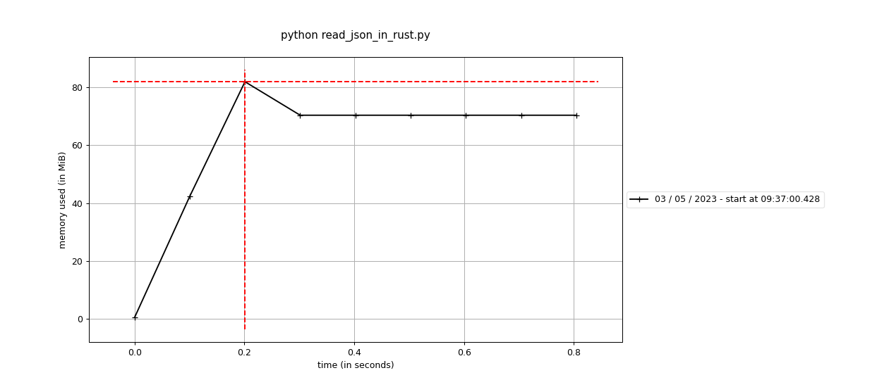
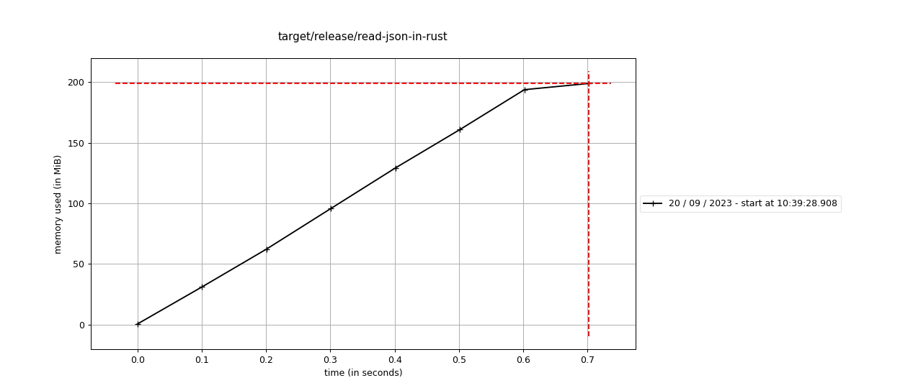
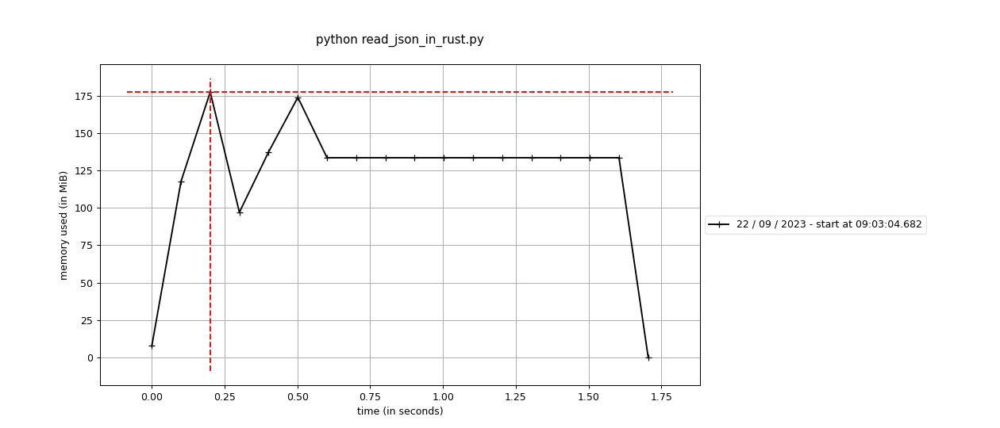
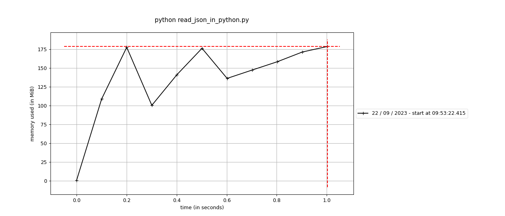

# Read JSON in Rust

> [!NOTE]
> Updated to use published data instead.

[Rust](https://www.rust-lang.org/) is a system-level programming language that is compiled ahead of time (like Java, Go, C, C++ ,...).

In this tutorial we are going to read JSON, update the data and write to a new file.

You can follow along at your own computer or at [replit.com](https://replit.com)

## Download data

To run the examples, you need some data to work on, the [Makefile](./Makefile) includes recipes to download skbl.json from https://spraakbanken.gu.se and extract the array `entries` using [jq](https://jqlang.github.io/jq/), `make download-data`.

The dataset includes 2059 entries and weights 39 Mb in compacted form.

## Python example

We begin by looking at an example from karp-backend-5 where we read and update an JSON file.

```python
import json
import time
import typing


def main():
    start = time.perf_counter()

    data_source = load_from_file("data/skbl.json")

    def doc_update(doc):
        doc["lexiconName"] = "skbl2"
        doc["lexiconOrder"] = 48
        return doc

    for doc in data_source:
        doc_update(doc)

    dump_to_file(data_source, "data/skbl2_python.json")

    elapsed = time.perf_counter() - start
    print(f"Elapsed time: {elapsed} s")


def load_from_file(path: str) -> typing.Any:
    with open(path) as file:
        source = file.read()
        return json.load(source)

def dump_to_file(value: list[typing.Any], path: str):
    with open(path, mode="w") as file:
        json.dump(value, file)


if __name__ == "__main__":
    main()
```

When running it we get this:
```bash
> python read_json_in_rust.py
Elapsed time: 1.792407828004798 s
```
Memory usage:


## Rewrite that in Rust

We begin with that timings,

### Setting up a cargo project

`cargo` is Rust's package manager, we can create a project:
```bash
> cargo new read-json-in-rust
    Created binary (application) `read-json-in-rust` package
```

If we `cd` into the directory we can run our application:
```bash
> cd read-json-in-rust
> cargo run
   Compiling read-json-in-rust v0.1.0 (.../read-json-in-rust)
    Finished dev [unoptimized + debuginfo] target(s) in 0.85s
     Running `target/debug/read-json-in-rust`
Hello, world!
```

Working correctly, and this is the code:
```rust
fn main() {
    println!("Hello, world!");
}
```

We have a function (`fn`) `main` that uses a macro (invoked with `!` after) to print `Hello, world!` with new-line to `stdout`.
The macro is because rust functions can't handle variadic functions, but rust macros can.

### Add timings

```rust

use std::time::Instant;

fn main() {
    let start = Instant::now();

    println!("Elapsed time {:?}", start.elapsed());
}
```

All variable must be declared with `let`.
The notation `"{:?}"` tells rust to use the `Debug` formatter for `Instant`, that is implemented for the most types, but for many types the standard `Display` formatter isn't not implemented (so is the case for `Instant`).

### function load_from_file

So let's add the function `load_from_file`.
Let us begin to sketch a solution.

```rust
fn main() {
    let start = Instant::now();

    let data_source = load_from_file("data/skbl.json");
    ...
}

fn load_from_file(path: &str) {
    todo!("load data from {}", path)
}
```

**Notes:** `str` is the string slice type in rust, and `&` is a reference (borrow) to, in this case, a string slice. So `load_from_file` borrows (a reference to) the string slice from it's caller.

We use the `todo`-macro, that end execution and prints the given message. Running this gives:
```bash
> cargo run
   Compiling read-json-in-rust v0.1.0 (.../read-json-in-rust)
warning: unused variable: `data_source`
  --> src/main.rs:11:9
   |
11 |     let data_source = load_from_file("data/skbl.json");
   |         ^^^^^^^^^^^ help: if this is intentional, prefix it with an underscore: `_data_source`
   |
   = note: `#[warn(unused_variables)]` on by default

warning: `read-json-in-rust` (bin "read-json-in-rust") generated 2 warnings (run `cargo fix --bin "read-json-in-rust"` to apply 1 suggestion)
    Finished dev [unoptimized + debuginfo] target(s) in 0.35s
     Running `target/debug/read-json-in-rust`
thread 'main' panicked at 'not yet implemented: load data from data/skbl.json', src/main.rs:18:5
note: run with `RUST_BACKTRACE=1` environment variable to display a backtrace
```

We can see that the program panicked with the message `not yet implemented: load data from data/skbl.json` and the location in the source file `src/main.rs:18:5`. This allows us to sketch the flow in the program.
- panics is one of rust's way of handling errors, abort the program if something fails

We can also see that the compiler warns us that the varialbe `data_source` is unused.

Let's start to implement the function!
#### Serde

In rust the de-facto standard for serialization and deserialization in Rust is [serde](https://serde.rs), and especially the **_crate_** [`serde_json`](https://crates.io/crates/serde_json). Let's add it to our project:
```bash
> cargo add serde_json
    Updating crates.io index
      Adding serde_json v1.0.96 to dependencies.
             Features:
             + std
             - alloc
             - arbitrary_precision
             - float_roundtrip
             - indexmap
             - preserve_order
             - raw_value
             - unbounded_depth
```

Great, we added `serde_json` to our project. The `cargo add` also lists the features that are available for this crate, but we don't need to bother about that.

Let's try to run it:

```bash
> cargo run
    Updating crates.io index
  Downloaded ryu v1.0.13
  Downloaded serde v1.0.160
  Downloaded serde_json v1.0.96
  Downloaded itoa v1.0.6
  Downloaded 4 crates (278.9 KB) in 0.38s
   Compiling serde v1.0.160
   Compiling serde_json v1.0.96
   Compiling ryu v1.0.13
   Compiling itoa v1.0.6
   Compiling read-json-in-rust v0.1.0 (.../read-json-in-rust)
warning: unused variable: `data_source`
 --> src/main.rs:2:9
  |
2 |     let data_source = load_from_file("data/skbl.json");
  |         ^^^^^^^^^^^ help: if this is intentional, prefix it with an underscore: `_data_source`
  |
  = note: `#[warn(unused_variables)]` on by default

warning: `read-json-in-rust` (bin "read-json-in-rust") generated 1 warning (run `cargo fix --bin "read-json-in-rust"` to apply 1 suggestion)
    Finished dev [unoptimized + debuginfo] target(s) in 4.21s
     Running `target/debug/read-json-in-rust`
thread 'main' panicked at 'not yet implemented: load data from data/skbl.json', src/main.rs:6:5
note: run with `RUST_BACKTRACE=1` environment variable to display a backtrace
```

Ok, what happend?
1. `cargo` downloads the needed crates to compile our crate. For us it means that `serde_json` and all dependencies for it is downloaded.
2. `cargo` then compiles everything and then links everything together.
    - `cargo` emits a warning that we don't use the variable `data_source` in main.
    - These steps is also available as `cargo build`.
3. `cargo` runs our application
4. our application panics with the message `not yet implemented: load data from data/skbl.json`
    - panics is one of rust's way of handling errors, abort the program if something fails

So let's read the JSON file:

```rust
use std::fs::File; // (3)
use std::time::Instant;

use serde_json::Value; // (1)

fn load_from_file(path: &str) -> Value { // (2)
    let file = File::open(path).expect("a valid path"); // (4)
    serde_json::from_reader(file).expect("successfully parsed JSON") // (5)
}
```

Comments:
1. We import the type `Value` from `serde_json`.
2. We add the return type `Value` to `load_from_file`.
3. We import the type `File` from `std::fs`.
4. We try to open the path, and panics if anything goes wrong. See below.
5. We parse the json file to the type `Value` and panics if anything goes wrong. The last line of a function is an implicit return (if it doesn't have a `;` at the end). We could write `return serde_json::from_reader(file).expect("successfully parsed JSON");` instead, but that is considered un-idiomatic Rust (but use for early returns).

> [!NOTE]
> Rust has no runtime exceptions, but instead uses a specific enum [`Result`](https://doc.rust-lang.org/std/result/enum.Result.html) to signal if something worked or failed. `Result` is defined as
> ```rust
> pub enum Result<T, E> {
>    Ok(T),
>    Err(E)
> }
> ```
> That is a generic enum where the first generic parameter `T` is the success type and the second `E` is the error type. Enum members are usually used by specifing them with the enum name, as in `Result::Ok`, but as that would be a bit verbose, both *variants* of are automatically imported.
>
> So how can we use a `Result`? Here come some examples
> ```rust
> let ok: Result<i32, &str> = Ok(42); // An Ok of an integer
> let err: Result<i32, &str> = Err("wrong answer"); // An Err of a string slice
> ```
> But how do you use a `Result`? You are forced to handle the possibly error before you can use a value.
> ```rust
> let val = ok.unwrap(); // Will take the value inside the result if it is Ok, otherwise panic.
> let msg = err.unwrap(); // Will panic with the message 'called `Result::unwrap()` on an `Err` value: "wrong answer"'
> // A more informative way to panic is use `expect`
> let val = ok.expect("should be an integer"); // Will take the value
> let val = err.expect("should be an integer"); // Will panic with the message 'should be an integer: "wrong answer"'
> // We can `match` on the enum variants
> let val = match ok {
>    Ok(val) => val,
>    Err(err) => panic!("should be an integer: '{}'", err),
> }; // Will take the value
> let val = match err {
>    Ok(val) => val,
>    Err(err) => panic!("should be an integer: '{}'", err),
> }; // Will panic with the message 'should be an integer: 'wrong answer''
> let sum = ok + 1; // This will not compile: 'cannot add `{integer}` to `Result<i32, &str>`'
> let sum = ok.unwrap() + 1;
> assert_eq!(sum, 43); // This tests that sum == 43 and panics otherwise
> // We can also handle an err with `unwrap_or`
> assert_eq!(ok.unwrap_or(24), 42); // no difference for the Ok value
> assert_eq!(err.unwrap_or(24), 24); // Since err is an Err, use the value from unwrap_or
> // Another alternative is to only work on the ok value, but keep the err if present
> let sum_ok = ok.map(|v| v + 1); // map calls the given function with the value, if it is an Ok.
> assert_eq!(sum_ok, Ok(43));
> let sum_err = err.map(|v| v + 1); // our function will not be called
> assert_eq!(sum_err, Err("wrong answer"));
> ```
> The last alternative is inspired from functional languages like `Haskell` and is sometimes called `railway programming`.
> Try it out at [Rust Playground](https://play.rust-lang.org/?version=stable&mode=debug&edition=2021&gist=98532489e46c74247a6cdaa2502d7dbe)

Great, let's run it!
```bash
> cargo run
   Compiling read-json-in-rust v0.1.0 (.../read-json-in-rust)
warning: unused variable: `data_source`
  --> src/main.rs:11:9
   |
11 |     let data_source = load_from_file("data/skbl.json");
   |         ^^^^^^^^^^^ help: if this is intentional, prefix it with an underscore: `_data_source`
   |
   = note: `#[warn(unused_variables)]` on by default

warning: `read-json-in-rust` (bin "read-json-in-rust") generated 2 warnings (run `cargo fix --bin "read-json-in-rust"` to apply 1 suggestion)
    Finished dev [unoptimized + debuginfo] target(s) in 0.45s
     Running `target/debug/read-json-in-rust`
Elapsed time 37.309493395s
```

Ouch, more than 37 seconds, something must be wrong.

Yes, by looking in [the `serde_json` docs for `from_reader`](https://docs.rs/serde_json/latest/serde_json/fn.from_reader.html) we can read:
> When reading from a source against which short reads are not efficient, such as a File, you will want to apply your own buffering because serde_json will not buffer the input. See std::io::BufReader.

Let's try that:
```rust
use std::fs::File;
use std::io::BufReader; // (1)
use std::time::Instant;

use serde_json::Value;

fn load_from_file(path: &str) -> Value {
    let file = File::open(path).expect("a valid path");
    let reader = BufReader::new(file); // (2)
    serde_json::from_reader(reader).expect("successfully parsed JSON")
}
```

1. We import `BufReader`.
2. We create a `BufReader` wrapping the file. The `BufReader` keeps an internal buffer, that it makes a large read to and then makes small reads from that buffer. (And yes, `Python` does that for us by default).

How long does this take?
```bash
> cargo run
   Compiling read-json-in-rust v0.1.0 (.../read-json-in-rust)
warning: unused variable: `data_source`
  --> src/main.rs:11:9
   |
11 |     let data_source = load_from_file("data/skbl.json");
   |         ^^^^^^^^^^^ help: if this is intentional, prefix it with an underscore: `_data_source`
   |
   = note: `#[warn(unused_variables)]` on by default

warning: `read-json-in-rust` (bin "read-json-in-rust") generated 2 warnings (run `cargo fix --bin "read-json-in-rust"` to apply 1 suggestion)
    Finished dev [unoptimized + debuginfo] target(s) in 0.69s
     Running `target/debug/read-json-in-rust`
Elapsed time 3.713371222s
```

Ok, some improvment, from 37.3s to 3.71s, but still twice as slow as `Python`. But let's not bother about that yet.

## Dump JSON

Next up is to write the json to a new file, we add these lines to our main:

```rust
    let updated_data = data_source;
    dump_to_file(&updated_data, "data/skbl2_rust.json");
```

And add this function:

```rust
fn dump_to_file(value: &Value, path: &str) {
    let writer = BufWriter::new(File::create(path).expect("failed to create file"));
    serde_json::to_writer(writer, value).expect("failed to serialize json")
}
```

1. We take value and path by reference (borrows them).
2. We create a file for writing with `File::create`, and panic on errors.
3. That file is unbuffered, so we add a `BufWriter` around the file to buffer the writes.
4. We serialize the `value` with serde_json.

After a successful `cargo run` we can look at our files:

```bash
> ls -l data
.rw-r--r-- 39M kristoffer  2 maj 14:36  skbl.json
.rw-r--r-- 42M kristoffer 20 sep 10:27  skbl2_python.json
.rw-r--r-- 39M kristoffer  2 maj 15:14  skbl2_rust.json
```

Ok, we created the file `skbl2_rust.json`, but it is smaller than `skbl2_python.json`, why is that?

Inspections gives that `skbl2_python.json` is written with ascii (default in Python's `json` library) and `skbl2_rust.json` uses utf-8.

## Update the data

And of course we want to update the data also. How did we do it in python?
```python
    def doc_update(doc):
        doc["lexiconName"] = "skbl2"
        doc["lexiconOrder"] = 48
        return doc

    for doc in data_source:
        doc_update(doc)

```

Seems simple, we update the documents in `data_source` directly, let's try that in Rust.

```rust
    fn doc_update(doc: Value) {
        doc["lexiconName"] = "skbl2";
        doc["lexiconOrder"] = 48;
    }

    for doc in data_source {
        doc_update(doc);
    }
```

So running this gives us:

```bash
> cargo run
   Compiling read-json-in-rust v0.1.0 (.../dev-tutorials/read-json-in-rust)
error[E0277]: `Value` is not an iterator
  --> src/main.rs:18:16
   |
18 |     for doc in data_source {
   |                ^^^^^^^^^^^ `Value` is not an iterator
   |
   = help: the trait `Iterator` is not implemented for `Value`
   = note: required for `Value` to implement `IntoIterator`

error[E0308]: mismatched types
  --> src/main.rs:14:41
   |
14 |         doc["lexiconName"] = "skbl2";
   |         -----------------------------   ^^^^^^^ expected `Value`, found `&str`
   |         |
   |         expected due to the type of this binding
   |
help: call `Into::into` on this expression to convert `&'static str` into `Value`
   |
14 |         doc["lexiconName"] = "skbl2".into();
   |                                                +++++++

error[E0308]: mismatched types
  --> src/main.rs:15:42
   |
15 |         doc["lexiconOrder"] = 48;
   |         ------------------------------   ^^ expected `Value`, found integer
   |         |
   |         expected due to the type of this binding

Some errors have detailed explanations: E0277, E0308.
For more information about an error, try `rustc --explain E0277`.
error: could not compile `read-json-in-rust` (bin "read-json-in-rust") due to 3 previous errors
```

Ok, that didn't work, but the compiler gives us some hints.

We begin with the errors `error[E0308]: mismatched types`, the compiler suggests that we shall add `.into()` after `"skbl2"` to convert `&'static str` into `Value`.

> [!NOTE]
> The type `&'static str` is composed of the reference operator (borrow) `&`, a lifetime on that reference `'static` and the string-slice type `str`. And almost always the string-slice type is used together as a reference, that is as `&str`. The special lifetime `'static` says that the string slice is valid for the whole program (it is in fact stored in the executable).

So let's follow the help.
```rust
    fn doc_update(doc: Value) {
        doc["lexiconName"] = "skbl2".into();
        doc["lexiconOrder"] = 48.into();
    }

    for doc in data_source {
        doc_update(doc);
    }
```

That helped!

```bash
cargo run
   Compiling read-json-in-rust v0.1.0 (/home/kristoffer/projekt/sb/dev-tutorials/read-json-in-rust)
error[E0277]: `Value` is not an iterator
  --> src/main.rs:18:16
   |
18 |     for doc in data_source {
   |                ^^^^^^^^^^^ `Value` is not an iterator
   |
   = help: the trait `Iterator` is not implemented for `Value`
   = note: required for `Value` to implement `IntoIterator`

For more information about this error, try `rustc --explain E0277`.
error: could not compile `read-json-in-rust` (bin "read-json-in-rust") due to previous error
```

So the next problem is that `data_source` is not an `Iterator`, that is implements the **_trait_** `Iterator`.

> [!NOTE]
> From the [Rust Book](https://doc.rust-lang.org/book/ch10-02-traits.html) about _**Traits**_:
>> A *trait* defines functionality a particular type has and can share with other types. We can use traits to define shared behavior in an abstract way. We can use *trait bounds* to specify that a generic type can be any type that has certain behavior.
>
> Traits is similar to *interfaces* (or *abstract classes*) in other languages.

So what is the `Value` we are using? If look at the [docs](https://docs.rs/serde_json/latest/serde_json/enum.Value.html) we see that `Value` is a `enum` of valid json types:
```rust
pub enum Value {
    Null,
    Bool(bool),
    Number(Number),
    String(String),
    Array(Vec<Value>),
    Object(Map<String, Value>),
}
```

Rust's `enum`s are quite powerful that let's us associate different types with the different enumerations. We expect our data to be stored as an `Array` so in the docs we find
> `pub fn as_array(&self) -> Option<&Vec<Value>>`
>
> If the Value is an Array, returns the associated vector. Returns None otherwise.

So adding that gives us:
```rust
    fn doc_update(doc: Value) {
        doc["lexiconName"] = "skbl2".into();
        doc["lexiconOrder"] = 48.into();
    }

    for doc in data_source.as_array().expect("an array") {
        doc_update(doc);
    }
```

And running it
```bash
> cargo run
   Compiling read-json-in-rust v0.1.0 (.../dev-tutorials/read-json-in-rust)
error[E0308]: mismatched types
  --> src/main.rs:19:20
   |
19 |         doc_update(doc);
   |         ---------- ^^^ expected `Value`, found `&Value`
   |         |
   |         arguments to this function are incorrect
   |
note: function defined here
  --> src/main.rs:13:8
   |
13 |     fn doc_update(doc: Value) {
   |        ^^^^^^^^^^ ----------
help: consider using clone here
   |
19 |         doc_update(doc.clone());
   |                       ++++++++

For more information about this error, try `rustc --explain E0308`.
error: could not compile `read-json-in-rust` (bin "read-json-in-rust") due to previous error
```

So we get the error that `doc_update` expects `Value` but we try to call it with `&Value` (a borrow).
Here the suggestion doesn't work for us, we want a borrow to update the document in place.
So let's try to change `doc_update` to take a borrow.
```rust
    fn doc_update(doc: &Value) {
        doc["lexiconName"] = "skbl2".into();
        doc["lexiconOrder"] = 48.into();
    }

    for doc in data_source.as_array().expect("an array") {
        doc_update(doc);
    }
```

And running it:
```bash
❯ cargo run
   Compiling read-json-in-rust v0.1.0 (.../dev-tutorials/read-json-in-rust)
error[E0596]: cannot borrow `*doc` as mutable, as it is behind a `&` reference
  --> src/main.rs:14:9
   |
14 |         doc["lexiconName"] = "skbl2".into();
   |         ^^^ `doc` is a `&` reference, so the data it refers to cannot be borrowed as mutable
   |
help: consider changing this to be a mutable reference
   |
13 |     fn doc_update(doc: &mut Value) {
   |                         +++

error[E0596]: cannot borrow `*doc` as mutable, as it is behind a `&` reference
  --> src/main.rs:15:9
   |
15 |         doc["lexiconOrder"] = 48.into();
   |         ^^^ `doc` is a `&` reference, so the data it refers to cannot be borrowed as mutable
   |
help: consider changing this to be a mutable reference
   |
13 |     fn doc_update(doc: &mut Value) {
   |                         +++

For more information about this error, try `rustc --explain E0596`.
error: could not compile `read-json-in-rust` (bin "read-json-in-rust") due to 2 previous errors
```

So now we aren't allowed to change doc through a `&Value` reference, but we need a `&mut Value`.
> [!NOTE]
> The rust compiler has an ownership system that tracks what part of the code owns a value. A owner can gives either one (1) mutable reference to a value or many readable references.
> This is a restriction from the insight that many bugs comes from ...

So if `doc_update` takes a mutable reference
```rust
    fn doc_update(doc: &mut Value) {
        doc["lexiconName"] = "skbl2".into();
        doc["lexiconOrder"] = 48.into();
    }

    for doc in data_source.as_array().expect("an array") {
        doc_update(doc);
    }
```

The compiler now complains that ...
```bash
❯ cargo run
   Compiling read-json-in-rust v0.1.0 (/home/kristoffer/projekt/sb/dev-tutorials/read-json-in-rust)
error[E0308]: mismatched types
  --> src/main.rs:19:20
   |
19 |         doc_update(doc);
   |         ---------- ^^^ types differ in mutability
   |         |
   |         arguments to this function are incorrect
   |
   = note: expected mutable reference `&mut Value`
                      found reference `&Value`
note: function defined here
  --> src/main.rs:13:8
   |
13 |     fn doc_update(doc: &mut Value) {
   |        ^^^^^^^^^^ ---------------

For more information about this error, try `rustc --explain E0308`.
error: could not compile `read-json-in-rust` (bin "read-json-in-rust") due to previous error
```
the `doc` in the `for`-loop is not mutable. So we need the `data_source` as an mut array. In the docs we find:
> `pub fn as_array_mut(&mut self) -> Option<&mut Vec<Value>>`
>
> If the Value is an Array, returns the associated mutable vector. Returns None otherwise.

Let's use that.
```rust
    fn doc_update(doc: &mut Value) {
        doc["lexiconName"] = "skbl2".into();
        doc["lexiconOrder"] = 48.into();
    }

    for doc in data_source.as_array_mut().expect("an array") {
        doc_update(doc);
    }
```

Running that gives us.
```bash
> cargo run
   Compiling read-json-in-rust v0.1.0 (.../dev-tutorials/read-json-in-rust)
error[E0596]: cannot borrow `data_source` as mutable, as it is not declared as mutable
  --> src/main.rs:18:16
   |
18 |     for doc in data_source.as_array_mut().expect("an array") {
   |                ^^^^^^^^^^^^^^^^^^^^^^^^^^ cannot borrow as mutable
   |
help: consider changing this to be mutable
   |
11 |     let mut data_source = load_from_file("data/skbl.json");
   |         +++

For more information about this error, try `rustc --explain E0596`.
error: could not compile `read-json-in-rust` (bin "read-json-in-rust") due to previous error
```

Of course, we need that specify that `data_source` can be mutated.
```rust
    let mut data_source = load_from_file("data/skbl.json");
```

And, bang, it works!
```bash
❯ cargo run
   Compiling read-json-in-rust v0.1.0 (.../dev-tutorials/read-json-in-rust)
    Finished dev [unoptimized + debuginfo] target(s) in 0.31s
     Running `target/debug/read-json-in-rust`
Elapsed time 4.908370832s
```

But the time it took, almost 5 seconds, what can be done about that?

## Optimizations
Let's try with some optimizations, we turn them on by passing `--release` to `cargo run`.

```bash
> cargo run --release
   Compiling serde v1.0.160
   Compiling serde_json v1.0.96
   Compiling ryu v1.0.13
   Compiling itoa v1.0.6
   Compiling read-json-in-rust v0.1.0 (.../dev-tutorials/read-json-in-rust)
    Finished release [optimized] target(s) in 4.93s
     Running `target/release/read-json-in-rust`
Elapsed time 687.616607ms
```

Ok, that was better!

### Memory usage
How does the memory usage look for the rust version?

The measure memory usage with [memory-profiler](https://pypi.org/project/memory-profiler/)
```bash
> mprof run target/release/read-json-in-rust
mprof: Sampling memory every 0.1s
running new process
Elapsed time 730.408381ms
```
Memory usage for the rust program:


And as reference, the memory usage for the python program:


Rust use slightly more memory but their memory usage is in the same magnitude.

### Read file to a string
Sometimes the loading can be improved by reading the whole file to a `String`. Let's try that:
```rust
fn load_from_file(path: &str) -> Value {
    let mut content = String::new();
    let file = File::open(path)
        .expect("a valid path")
        .read_to_string(&mut content)
        .expect("a valid JSON file");
    serde_json::from_str(&content).expect("successfully parsed json")
}
```

So running that gives us:
```bash
> cargo run --release
   Compiling read-json-in-rust v0.1.0 (.../dev-tutorials/read-json-in-rust)
warning: unused import: `BufReader`
 --> src/main.rs:3:15
  |
3 | use std::io::{BufReader, BufWriter};
  |               ^^^^^^^^^
  |
  = note: `#[warn(unused_imports)]` on by default

error[E0599]: no method named `read_to_string` found for struct `File` in the current scope
   --> src/main.rs:30:10
    |
28  |       let file = File::open(path)
    |  ________________-
29  | |         .expect("a valid path")
30  | |         .read_to_string(&mut content)
    | |         -^^^^^^^^^^^^^^ method not found in `File`
    | |_________|
    |
    |
   ::: /home/kristoffer/.rustup/toolchains/stable-x86_64-unknown-linux-gnu/lib/rustlib/src/rust/library/std/src/io/mod.rs:769:8
    |
769 |       fn read_to_string(&mut self, buf: &mut String) -> Result<usize> {
    |          -------------- the method is available for `File` here
    |
    = help: items from traits can only be used if the trait is in scope
help: the following trait is implemented but not in scope; perhaps add a `use` for it:
    |
2   + use std::io::Read;
    |

For more information about this error, try `rustc --explain E0599`.
warning: `read-json-in-rust` (bin "read-json-in-rust") generated 1 warning
error: could not compile `read-json-in-rust` (bin "read-json-in-rust") due to previous error; 1 warning emitted
```

So we get a warning for an unused import and an error: no method `read_to_string` found for struct `File`

Hm, but later it says that the method is available for File in the **_trait_** `std::io::Read`. A trait in rust is an interface type, and, as the compiler suggest, a trait must be in scope to able to use it.

So let bring it in scope by adding `use std::io::Read`.
```bash
> cargo run --release
   Compiling read-json-in-rust v0.1.0 (.../dev-tutorials/read-json-in-rust)
    Finished release [optimized] target(s) in 0.56s
     Running `target/release/read-json-in-rust`
Elapsed time 425.541856ms
```

Yes, that improved the running time.

How is the memory usage changed?


#### Can we use the same technic when writing to a file?

```diff
fn dump_to_file(value: &Value, path: &str) {
-    let writer = BufWriter::new(File::create(path).expect("failed to create file"));
-    serde_json::to_writer(writer, value).expect("failed to serialize json")
+    let buffer = serde_json::to_string(value).expect("failed to serialize json");
+    let mut file = File::create(path).expect("failed to create file");
+    file.write_all(buffer.as_bytes()).expect("write to succeed");

}
```

First, running this change with our BufReader-version:
```bash
> cargo run --release
    Finished release [optimized] target(s) in 0.01s
     Running `target/release/read-json-in-rust`
Elapsed time 628.662968ms
```

Yes, some improvement, but not as big as reading everything.

And then running it with our version to reads the whole file:
```bash
> cargo run --release
   Compiling read-json-in-rust v0.1.0 (.../dev-tutorials/read-json-in-rust)
    Finished release [optimized] target(s) in 0.48s
     Running `target/release/read-json-in-rust`
Elapsed time 363.911526ms
```

And we can se that we keep the slight improvement, but the big difference is made by read the whole file.

And that slight improvement is followed by a slight increase in the memory usage.


#### Can we use the same technic in Python?

Glad you asked, let's try it.

```diff
def load_from_file(path: str) -> typing.Any:
    with open(path) as file:
-        return json.load(file)
+        source = file.read()
+        return json.loads(source)
```

And running it gives ...
```bash
> python read_json_in_python.py
Elapsed time: 1.5982872919994406 s
```

a slight improvement, and how does the memory usage change?
```bash
> mprof run python read_json_in_python.py
mprof: Sampling memory every 0.1s
running new process
Elapsed time: 1.6285033419990214 s
```



Interesting to see that the maximum memory usage decreases when we read the whole file to memory.

And if we dump the JSON to a string first and then writes the string to a file.

```diff
def dump_to_file(value: list[typing.Any], path: str):
    with open(path, mode="w") as file:
-        json.dump(value, file)
+        buffer = json.dumps(value)
+        file.write(buffer)
```

Running it:
```bash
> python read_json_in_python.py
Elapsed time: 1.0124508890003199 s
```

Wow, so there we found a quite big improvement!

And again, let's look at the memory usage:


And the memory usage is less than our initial version.

### Deserialize to Vec directly

One strength of rust and serde is that we can deserialize directly to many types.

So let's try to deserialize to `Vec<Value>` instead.

```diff
-fn load_from_file(path: &str) -> Value {
+fn load_from_file(path: &str) -> Vec<Value> {

-   for doc in data_source.as_array_mut().expect("an array") {
+   for doc in &mut data_source {

-fn dump_to_file(value: &Value, path: &str) {
+fn dump_to_file(value: &[Value], path: &str) {

```

What is the different?
* If our file doesn't contains an array, `load_from_file` will fail, compared to that the call `as_array_mut` fails.
    - How strict are you about the incoming data?
* We write `dump_to_file` to take a array slice `&[Value]` instead of a `Vec`, then we can call that function with anything that can be read as a slice.

Does it matter?
```bash
> cargo run --release
    Finished release [optimized] target(s) in 0.01s
     Running `target/release/read-json-in-rust`
Elapsed time 408.153712ms
```

No, not for the speed. So you can choose what fits your program best.

## Conclusion

We have ported a simple Python program to Rust and seen a speedup by 2.5 to 4.4 times at the expense of using a bit more memory.

In Python we saw a 1.7 times improvement when we first read the file to str and then parse the JSON and when writing, first dumping to string and then writes that string to file. And the interesting thing was that we also used less memory this way.

## Next steps

- We read the whole find to memory, for large files it is needed to only read a document at a time and then write the updated to a the file.
- We read the documents as JSON value, we can also validate the data while deserializing.
- We should handle errors better (and report them to the user).


## References

- [Rust Book](https://doc.rust-lang.org/book/title-page.html) the official guide to Rust.
- [Rust Playground](https://play.rust-lang.org) try out some rust code in your browser.


