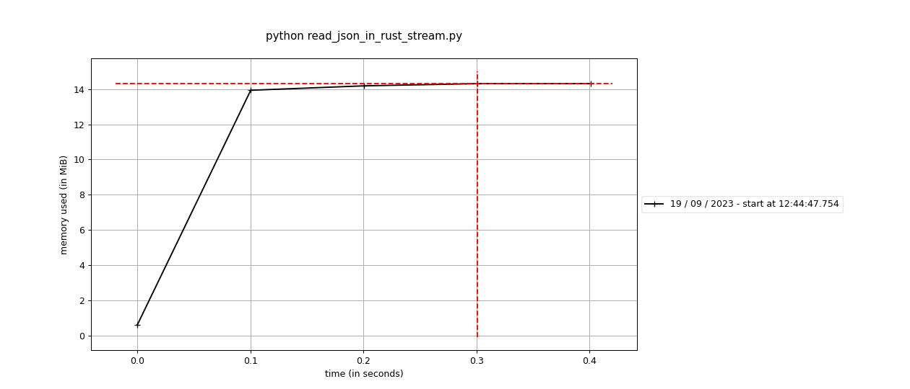
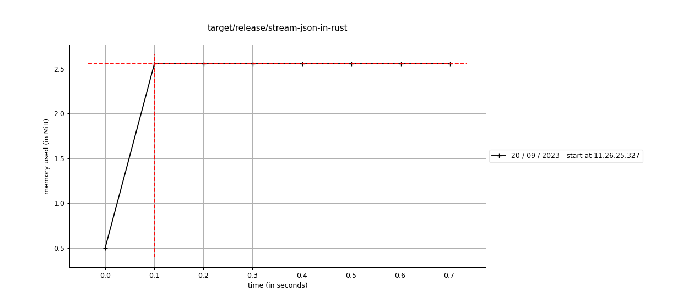

# Streaming JSON

This document builds on [Read JSON in rust](./README.md).

Ok, let's see how we can stream JSON documents, update them and then write them to a file.

## Python

In python we use [json-streams](https://github.com/spraakbanken/json-streams-py):
```python
import time

from json_streams import json_iter


def main():
    start = time.perf_counter()
    data_source = json_iter.load_from_file("data/skbl.json")

    def doc_update(doc):
        doc["lexiconName"] = "skbl2"
        doc["lexiconOrder"] = 48
        return doc

    update_data = (doc_update(doc) for doc in data_source)
    json_iter.dump_to_file(update_data, "data/skbl2_python_stream.json")
    end = time.perf_counter()
    print(f"Elapsed time: {end-start} s")


if __name__ == "__main__":
    main()
```

The code looks pretty similar, but some stuff is hidden in `json-streams`.

Running it gives
```bash
> python stream_json_in_python.py
Elapsed time: 0.8422206190007273 s
```

## Rust

In rust we build on [Struson](https://crates.io/crates/struson).

We work through the example.

```diff
-    let mut data_source = load_from_file("data/skbl.json");
+    let data_source = json_iter::load_from_file("data/skbl.json");
```

We put our code in the module `json_iter`.
```diff
-fn load_from_file(path: &str) -> Vec<Value> {
-    let mut content = String::new();
-    File::open(path)
-        .expect("a valid path")
-        .read_to_string(&mut content)
-        .expect("a valid JSON file");
-    serde_json::from_str(&content).expect("successfully parsed json")
-}
+pub mod json_iter { \\ (1)
+    pub fn load_from_file(path: &str) -> impl Iterator<Item = Value> { \\ (2)
+        let file = File::open(path).expect("a valid path");
+        let reader = BufReader::new(file);
+        let mut json_reader = JsonStreamReader::new(reader); \\ (3)
+
+        json_reader.begin_array().expect("an array"); \\ (4)
+        std::iter::from_fn(move || { \\ (5)
+            if json_reader.has_next().unwrap() {
+                let t: Value = json_reader.deserialize_next().expect("valid JSON");
+                Some(t)
+            } else {
+                None
+            }
+        })
+    }
+}
```
1. `mod` creates a module (it can also be created in a separate file or directory).
    - The `pub` is needed to allow `main` call the function.
2. Instead of returning a `Vec<Value>` we return a type that implements the **trait** `Iterator` and yields `Value`.
3. We use `JsonStreamReader` from `sturson`.
4. We try to read the start of an array.
5. We create an `Iterator` from a function (in this case a closure) that is called as long as `None` is **_not_** returned.

We need to update the code that updates documents:
```diff
-    fn doc_update(doc: &mut Value) {
-        doc["_source"]["lexiconName"] = "skbl2".into();
-        doc["_source"]["lexiconOrder"] = 48.into();
-    }
-
-    for doc in &mut data_source {
-        doc_update(doc);
-    }
+    fn doc_update(mut doc: Value) -> Value { \\ (1)
+        doc["_source"]["lexiconName"] = "skbl2".into();
+        doc["_source"]["lexiconOrder"] = 48.into();
+        doc
+    }
+
+    let update_data = data_source.map(|doc| doc_update(doc)); \\ (2)
```

1. We take the document by value, and passing it out again. No copy is made.
2. We use the `map` function on the `Iterator` trait to update the document, this is called first when the new iterator is iterated.

And lastly we need to update the `dump_to_file` code.
```diff
-fn dump_to_file(value: &[Value], path: &str) {
-    let writer = BufWriter::new(File::create(path).expect("failed to create file"));
-    serde_json::to_writer(writer, value).expect("failed to serialize json")
-}
+pub mod json_iter { \\ (1)
+    pub fn dump_to_file<I: Iterator<Item = Value>>(iter: I, path: &str) \\ (2)
+    {
+        let writer = BufWriter::new(File::create(path).expect("failed to create file"));
+        let mut json_writer = JsonStreamWriter::new(writer); \\ (3)
+        json_writer.begin_array().unwrap(); \\ (4)
+        for val in iter { \\ (5)
+            json_writer.serialize_value(&val).unwrap();
+        }
+        json_writer.end_array().unwrap(); \\ (4)
+        json_writer.finish_document().unwrap(); \\ (6)
+    }
+}
```
1. We move this function to `json_iter` module.
2. We make this function generic on the type `I` where `I` must implement the trait `Iterator<Item = Value>` (compare to Concepts in C++)
3. We use `JsonStreamWriter` from `struson`.
4. We manually write start and end of array.
5. We loop through the `iter` and serialize all values.
6. We finish the document (which flushes everything).

And running it gives us:
```bash
> cargo run --bin stream-json-in-rust --release
    Finished release [optimized] target(s) in 0.02s
     Running `target/release/stream-json-in-rust`
Elapsed time 755.032685ms
```

## Analysis

We can see that python makes a great improvement, from 1.79s to 0.84s, while rust runs at same speed for the BufReader version, and twice as slow as the String version.

And both the streaming versions (Python & Rust) runs at the same speed.

**Open question** How does this scale to larger JSON files?
### Memory usage

So let us see how the memory usage compares between Python and Rust.

Memory usage for our streaming python program:


Memory usage for our streaming rust program:


So rust uses just above 2.5 Mb for the whole run and python uses just above 14 Mb, so here we can se rust smaller footprint.
## Make json_iter more generic

When we look at our module `json_iter` we can see that this code is quite generic and can be used in other projects, but can we make it more generic?

Yes, we can change `Value` to a generic parameter `T`.

We begin with `dump_to_file`:

```diff
-    pub fn dump_to_file<I: Iterator<Item = Value>>(iter: I, path: &str)
+    pub fn dump_to_file<I, T>(iter: I, path: &str) // (1)
+    where // (2)
+        I: Iterator<Item = T>, // (3)
+        T: serde::Serialize, // (4)
    {
```

1. We add the generic parameter `T` in `<I, T>` (and move the trait restriction of I, see (3)).
2. We add the keyword `where` to allow us to move the type restrictions here for better readability.
3. We restricts `I` to be a `Iterator` with items `T`.
4. The trait function we used for `Value` was `serde::Serialize`, so we require `T` to implement that.

And then we continue with `load_from_file`:

```diff
-    pub fn load_from_file(path: &str) -> impl Iterator<Item = Value> {
+    pub fn load_from_file<'de, T>(path: &str) -> impl Iterator<Item = T> // (1)
+    where
+        T: serde::Deserialize<'de>, // (2)
+    {
```

1. We add a generic lifetime `'de` and a generic type `T` and require that this function will return an `Iterator` that yields `T`s.
2. We require `T` to implement `serde::Deserialize<'de>` (yes, the trait has a lifetime to allow deserializing from borrowed data).
